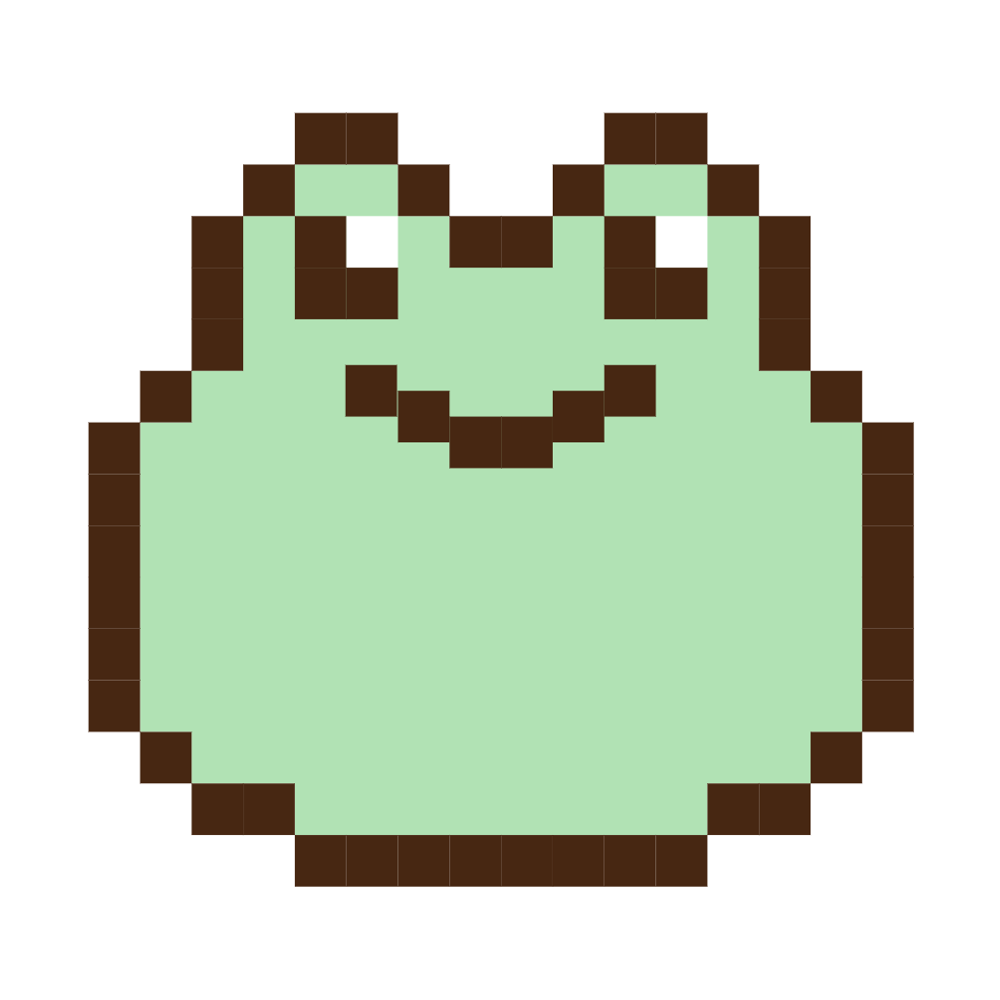

<h1 align="center"><b>Hi , 我是Wuuuu </b></h1>

<!-- 

  

 -->

 

## <picture></picture> **关于我**

<picture>
  <source media="(max-width: 767px)" srcset="">
  
</picture>

 

Hello, 欢迎来到我的 GitHub 简介，我是一位有 5 年经验的前端开发工程师，最近正在学习 Nest.js，并计划使用它来构建更强大的 Web 应用程序，致力于成为一个全栈开发～

- 有丰富的中后台和移动端开发经验

- 熟悉敏捷开发

  

## <b> Skills</b>

- **Languages**:

    &nbsp;
  &nbsp;
  &nbsp;
  &nbsp;

    
    
- **Front-End Development**:

&nbsp;
  &nbsp;

 

- **Softwares and Tools**:

  &nbsp;
  &nbsp;
  &nbsp;
  &nbsp;
  &nbsp;
